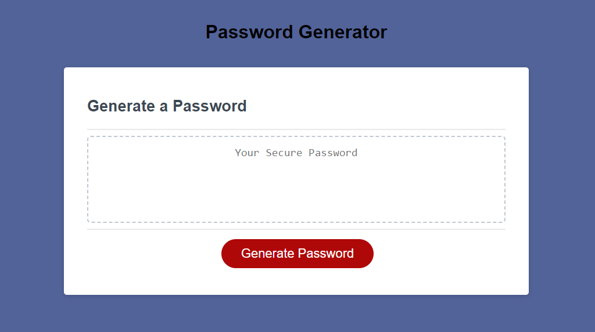

# Password-generator

## Password-generator Description

This assignment was focused on creating an application that would help the user create a random password consisting of, alpha-lower/uppercase characters also numeric and special characters. The password generator prompts the user how long the was is that they desire, consisting from 8 to 128 characters. then they are prompter if they would like to use any of the following characters, alpha/numeric lower and uppercase or special characters. After the user is done with their selections, then a random generated password is displayed on screed text box.

## Table of Contents

- [Description](#Description)
- [Screenshot](#Screenshot)
- [Link](#Link)
- [Credits](#credits)

## Description of Refactored page

1. On click the user is prompt for length of password
2. Then user is prompt what type of characters the user would like for his password
3. If users password is not sufficiant in length or no selection was made user is prompt to try again.

## Screenshot

## Link 

- Password Generator Website
https://juaisa99.github.io/password-generator/

## Credits/Resources

- Diarmuid Murphy (Instructor)
- Meg Meyers (TA) 

- How to create a readme (https://meakaakka.medium.com/a-beginners-guide-to-writing-a-kickass-readme-7ac01da88ab3)

